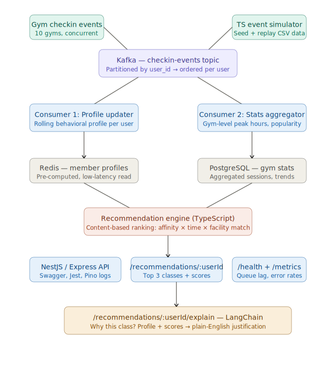

# FitStream

Real-Time Fitness Class Recommendation Engine with Event-Driven Member Profiling

## Objective

This project answers the core engineering question: **"How do you maintain consistent, low-latency member profiles across a distributed fitness network when events arrive concurrently from multiple gyms?"**

FitStream is a stateful streaming system where every check-in event mutates member profiles in real-time. These profiles feed a content-based ranking algorithm that produces explainable recommendations. This is not a query engine sitting on top of static data — it's an event-driven system that reacts to and updates its own state continuously.

## Architecture

